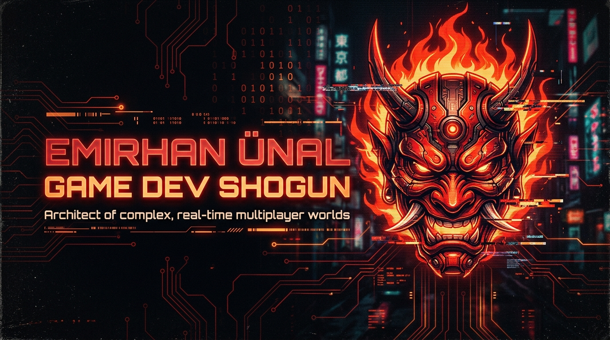
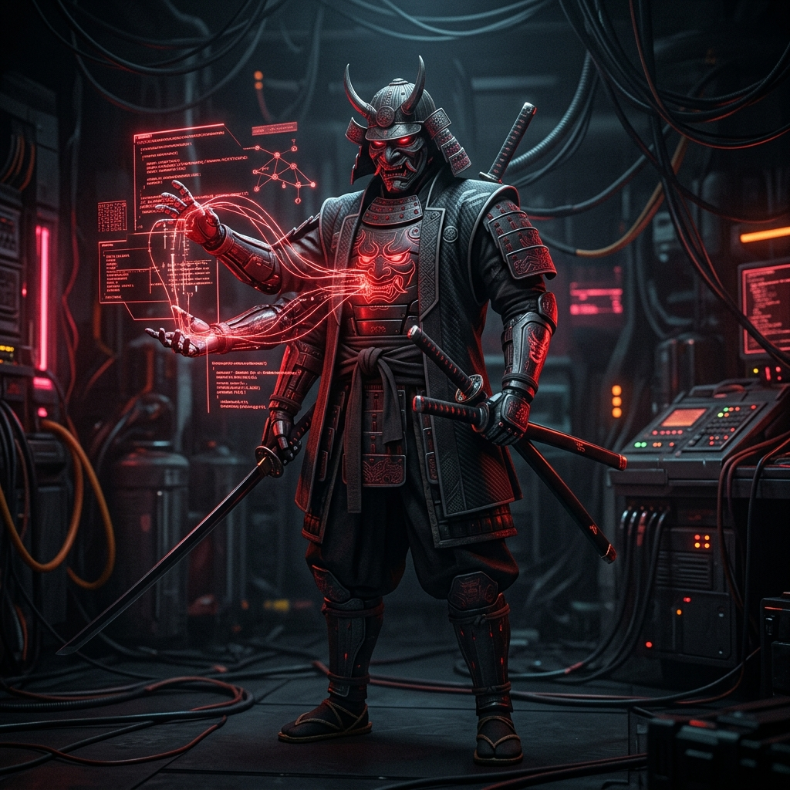
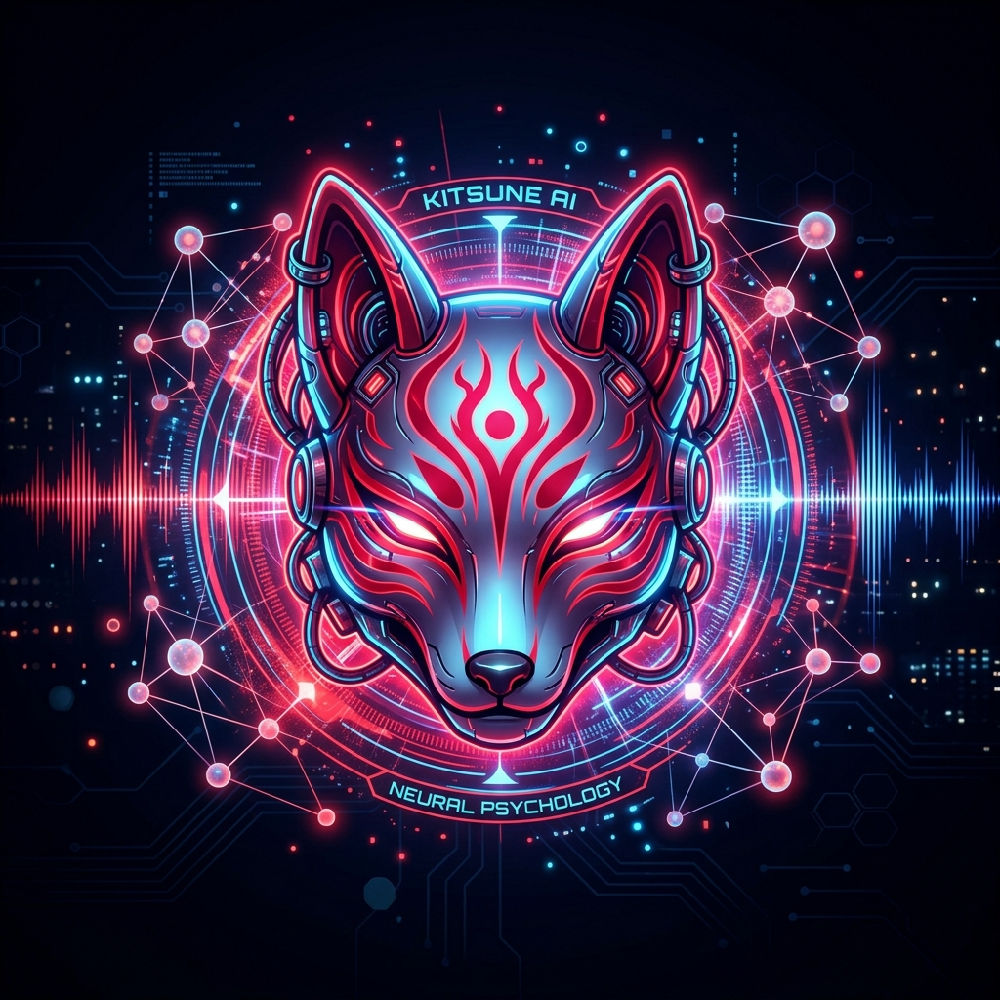
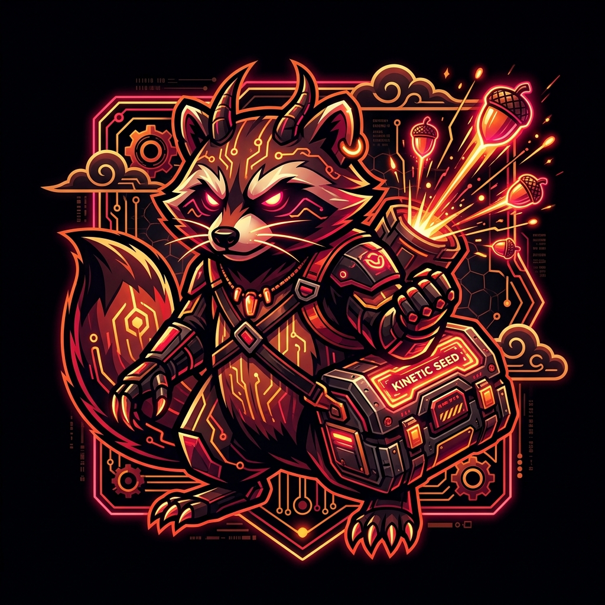
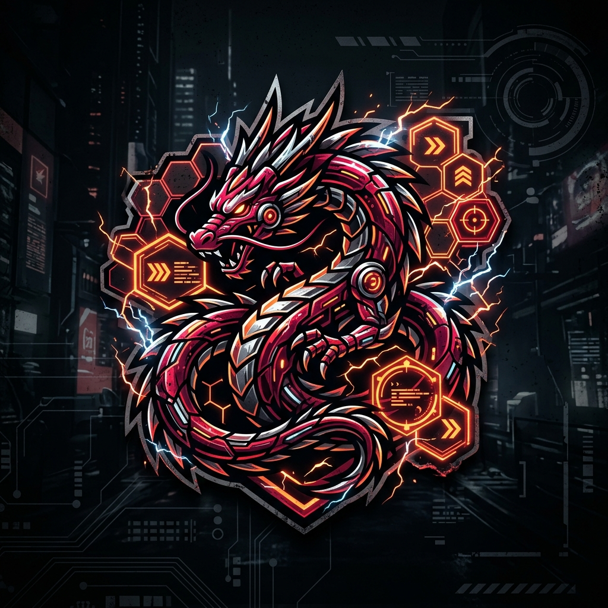
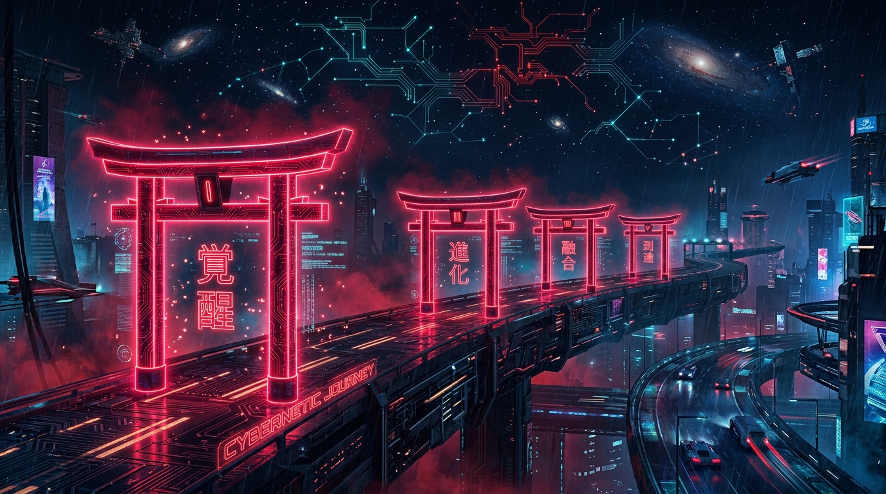
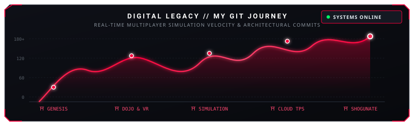

<div align="center">

<!-- TOP BANNER -->
<p align="center">
  
</p>

<!-- QUICK STATUS PILLS -->
<p align="center">
  <a href="https://store.steampowered.com/app/3989920/TaterUp/"></a>
  <a href="https://icarusogt.itch.io/"></a>
  <a href="https://www.linkedin.com/in/benemirhanunal/"></a>
  <a href="mailto:emirhan_60unal@hotmail.com"></a>
</p>


</div>

<br>

<!-- SECTION 1: ABOUT THE SHOGUN -->
## ⛩️ // SYSTEM.PROFILE: ABOUT THE SHOGUN

<table border="0" style="border-collapse: collapse; border: none;">
<tr>
<td width="58%" valign="top" style="border: none; padding-right: 15px;">

### ⚔️ `ARCHITECT_PROFILE.sys`
> **"Architect of complex, real-time multiplayer worlds."**

I am a **Game Developer & Computer Engineer** with **6+ years of industry experience** specializing in scalable multiplayer architectures, deterministic combat engines, and high-fidelity real-time simulations.

Throughout my tenure across gaming studios, healthcare research institutes (TÜSEB), and autonomous simulation labs:
* 🗡️ **Command & Leadership**: Directed and mentored multidisciplinary teams of up to **15+ engineers and artists**, while managing a **200+ developer community network**.
* 🌐 **Multiplayer & Networking**: Architected low-latency TPS multiplayer frameworks, state-replication models, and custom 20 Hz deterministic lockstep/tick engines using **Photon Fusion** and **Netcode**.
* 🧠 **Neural & Generative AI**: Engineered sub-6s latency multimodal voice pipelines integrating **Gemini STT/LLM** with **ElevenLabs TTS** and procedural CC5 viseme lip-sync.
* ⚡ **Performance & Physics**: Achieved **~35% runtime performance gains** through draw-call reduction, object pooling hierarchies, and low-level memory optimizations.

```csharp
// CORE ATTRIBUTES & MANIFEST
public sealed class ShogunArchitect : IGameEngineer 
{
    public const int ExperienceYears = 6;
    public const int LedTeamMembers   = 15;
    public const int CommunityNetwork = 200;
    
    public string CoreDomain => "Real-Time Multiplayer & Deterministic Systems";
    public string Status     => "Deploying Worlds // Pushing the Frontier";
}
```

</td>
<td width="42%" align="center" valign="middle" style="border: none;">
  
  <br>
  <sub><em>Cyber-Samurai: Manipulating neural code streams and distributed game state.</em></sub>
</td>
</tr>
</table>

<div align="center">

</div>

<br>

<!-- SECTION 2: FEATURED PROJECTS -->
## 🔮 // REPOSITORY ARTIFACTS: FEATURED PROJECTS

<table>
<!-- PROJECT 1: CLINITOPYA -->
<tr>
<td width="30%" align="center" valign="middle" style="background-color: #0b0d13; border: 1px solid #ff003c; border-radius: 8px;">
  
  <br>
  <strong style="color: #ff2a55; font-size: 16px;">CLINITOPYA</strong><br>
  <sub>🦊 <em>Kitsune Mask: Neural Shamanism &amp; AI</em></sub>
</td>
<td width="70%" valign="top" style="padding-left: 15px;">

### 🦊 `CLINITOPYA` — Generative AI Clinical XR Simulation
> **Platform**: Unity 6 • Meta Quest 3 VR • **Role**: Lead Developer

A cutting-edge VR clinical psychology training simulation featuring autonomous AI-driven NPC therapists that respond in real time to patient dialogue.
* 🎙️ **Sub-6s Voice Pipeline**: Engineered an ultra-low latency real-time voice pipeline synchronizing **Gemini STT**, **Gemini LLM**, and **ElevenLabs TTS**.
* 🎭 **Procedural Avatar Lip-Sync**: Integrated Reallusion CC5 character avatars with real-time ElevenLabs viseme data alignment.
* 📜 **ScriptableObject Persona Engine**: Modular architecture supporting dynamic scenario configurations and psychological archetypes.
* 📊 **Automated Competency Evaluation**: Built an automated session scoring engine grading across **10 clinical metrics** for 25+ student cohorts.

`Unity 6` `Meta Quest 3` `Gemini LLM` `ElevenLabs` `Reallusion CC5` `ScriptableObjects`

</td>
</tr>

<!-- PROJECT 2: NUTREVOLT -->
<tr>
<td width="30%" align="center" valign="middle" style="background-color: #0b0d13; border: 1px solid #ff003c; border-radius: 8px;">
  
  <br>
  <strong style="color: #ff2a55; font-size: 16px;">NUTREVOLT</strong><br>
  <sub>🦝 <em>Tanuki: Kinetic Seed Mastery</em></sub>
</td>
<td width="70%" valign="top" style="padding-left: 15px;">

### 🦝 `NUTREVOLT` — Kinetic Mobile Physics-Launcher
> **Platform**: Unity 6 Mobile (Android / iOS) • **Role**: Lead Unity Developer & Game Designer

A high-octane physics-driven arcade launcher built on momentum chaining, tactical skill triggers, and repeatable progression loops.
* ⚡ **Custom Physics Engine**: Engineered bespoke arcade collision kinematics, dynamic rebound mathematics, and abilities (*Cheek Boost*, *Belly Slam*).
* 🧱 **Modular C# Framework**: Decoupled systems leveraging Assembly Definitions, event buses, state controllers, and zero-allocation object pools.
* 🗺️ **Procedural Generation**: Infinite chunk generation with speed-adaptive encounter pacing and boss gates.
* 🛠️ **Custom Editor Telemetry**: Developed in-editor simulation harnesses for telemetry logging, deterministic validation, and real-time balancing.

`Unity 6` `C#` `Custom Arcade Physics` `Procedural Chunks` `Object Pooling` `ASMDEF`

</td>
</tr>

<!-- PROJECT 3: DRAFTINRIFT -->
<tr>
<td width="30%" align="center" valign="middle" style="background-color: #0b0d13; border: 1px solid #ff003c; border-radius: 8px;">
  
  <br>
  <strong style="color: #ff2a55; font-size: 16px;">DRAFTINRIFT</strong><br>
  <sub>🐉 <em>Ryu Dragon: Deterministic Battle Domain</em></sub>
</td>
<td width="70%" valign="top" style="padding-left: 15px;">

### 🐉 `DRAFTINRIFT` — Mobile Strategic Draft Auto-Battler
> **Platform**: Unity 6 & C# • **Role**: Lead Game Developer & Systems Architect

A deterministic mobile tactical draft auto-battler engineered with strict domain layer separation and reproducible golden state synchronization.
* 🎲 **Deterministic 20 Hz Simulation**: Complete combat engine encompassing targeting, ability casts, status effects, and reproducible outcome checksums.
* 🃏 **End-to-End Drafting Loop**: 3-option draft system, Tactical Credit rerolls, comeback mechanics, dynamic timers, and deterministic AI opponents.
* 🏛️ **Clean Layer Decoupling**: Rigid barrier between Domain Authority and Presentation layer, with 3D interpolation and responsive HUDs.
* 🛡️ **373 Verified Tests**: 100% stable test suite certifying cross-platform checksum repeatability and zero desync.

`Unity 6` `Deterministic 20Hz` `373 Passing Tests` `Clean Architecture` `Strategic AI`

</td>
</tr>
</table>

<details>
<summary><b>📜 Click to view Additional Production Deployments (Co-op Horrors &amp; Steam)</b></summary>

<br>

* 👻 **Haunted Moving Company** *(1–4 Player Co-op Horror Comedy)*:
  * Designed host-authoritative physics replication for synchronized cursed furniture hauling in dynamic haunted environments.
  * Steam-oriented lobby architecture and modular cursed-object behavioral rulesets.
* 🕯️ **Unreal Engine 5 Multiplayer Horror** *(2-Player Asymmetric Co-op)*:
  * Developed in UE5 with Epic Online Services (EOS), complementary medallion/torch revelation mechanics, and physics ragdoll NavMesh predators.
* 🥔 **[TaterUp (Steam Commercial Release)](https://store.steampowered.com/app/3989920/TaterUp/)**:
  * Shipped commercial indie title with full Steamworks integration, achievement tracking, and performance optimization.

</details>

<div align="center">

</div>

<br>

<!-- SECTION 3: TECH STACK MATRIX -->
## ⚡ // CYBERNETIC ARSENAL: TECH STACK

<table align="center" width="100%">
<tr>
  <td align="center" width="20%"><b>ENGINES &amp; CORE</b></td>
  <td align="center" width="20%"><b>MULTIPLAYER / NET</b></td>
  <td align="center" width="20%"><b>AI, XR &amp; GRAPHICS</b></td>
  <td align="center" width="20%"><b>CLOUD &amp; BACKEND</b></td>
  <td align="center" width="20%"><b>OPTIMIZATION</b></td>
</tr>
<tr>
  <td align="center" valign="top">
    <br>
    <br>
    <br>
    <br>
    
  </td>
  <td align="center" valign="top">
    <br>
    <br>
    <br>
    <br>
    
  </td>
  <td align="center" valign="top">
    <br>
    <br>
    <br>
    <br>
    
  </td>
  <td align="center" valign="top">
    <br>
    <br>
    <br>
    <br>
    
  </td>
  <td align="center" valign="top">
    <br>
    <br>
    <br>
    <br>
    
  </td>
</tr>
</table>

<div align="center">

</div>

<br>

<!-- SECTION 4: DIGITAL LEGACY / GIT JOURNEY & TORII GATES -->
## ⛩️ // DIGITAL LEGACY: MY GIT JOURNEY

<p align="center">
  
</p>

### ⛩️ The 5 Torii Gates of the Cyber Shogunate

<table>
<tr>
  <td width="20%" align="center" style="background-color: #0b0d13; border: 1px solid #ff003c; border-radius: 6px;">
    <h4>⛩️ GATE I<br><span style="color:#ff2a55;">覚醒 • THE AWAKENING</span></h4>
    <p><b>Genesis &amp; Academia</b></p>
    <p>BSc in Computer Engineering at <i>Eskişehir Osmangazi University</i>. Founded dev network uniting <b>200+ creators</b>.</p>
  </td>
  <td width="20%" align="center" style="background-color: #0b0d13; border: 1px solid #ff003c; border-radius: 6px;">
    <h4>⛩️ GATE II<br><span style="color:#ff2a55;">道場 • THE DOJO</span></h4>
    <p><b>Mentorship &amp; Agency</b></p>
    <p>Unity Instructor at <i>GameDesignAcademia</i> mentoring <b>100+ students</b>. Founded <i>Game Dev Initiative</i> delivering multi-engine pipelines.</p>
  </td>
  <td width="20%" align="center" style="background-color: #0b0d13; border: 1px solid #ff003c; border-radius: 6px;">
    <h4>⛩️ GATE III<br><span style="color:#ff2a55;">電脳 • SIMULATION</span></h4>
    <p><b>Digital Twins &amp; VR</b></p>
    <p>VR Specialist at <i>TÜSEB</i> (Clinical XR). Unity Lead at <i>Ash &amp; Pause Studios</i> (Digital twins, <b>~35% performance boost</b>).</p>
  </td>
  <td width="20%" align="center" style="background-color: #0b0d13; border: 1px solid #ff003c; border-radius: 6px;">
    <h4>⛩️ GATE IV<br><span style="color:#ff2a55;">合戦 • CLOUD TPS</span></h4>
    <p><b>Multiplayer Shogunate</b></p>
    <p>Game Developer at <i>Negentra Games</i>. Engineered full TPS multiplayer infrastructure with Photon Fusion &amp; <b>AWS/NVIDIA</b> cloud.</p>
  </td>
  <td width="20%" align="center" style="background-color: #0b0d13; border: 1px solid #ff003c; border-radius: 6px;">
    <h4>⛩️ GATE V<br><span style="color:#ff2a55;">到達 • MASTERWORK</span></h4>
    <p><b>Unity 6 Triad &amp; Steam</b></p>
    <p>Architected <b>Clinitopya</b> (Generative AI VR), <b>DraftinRift</b> (Deterministic 20Hz, 373 Tests), <b>NutRevolt</b>, &amp; Steam launch of <b>TaterUp</b>.</p>
  </td>
</tr>
</table>

<br>

<!-- CUSTOM CONTRIBUTION GRAPH & STATS -->
<div align="center">
  
  
  <br><br>
  
  <!-- GITHUB LIVE STATS IN CRIMSON THEME -->
  <p align="center">
    
    &nbsp;
    
  </p>
</div>

<div align="center">

</div>

<br>

<!-- SECTION 5: COMMAND NEXUS (CONNECT) -->
<div align="center">

## 📡 // COMMAND NEXUS: CONNECT &amp; DISPATCH

<p>
  <em>"Code is the katana of the digital realm — sharpened by discipline, validated by tests."</em>
</p>

<p align="center">
  <a href="https://www.linkedin.com/in/benemirhanunal/" target="_blank">
    
  </a>
  &nbsp;
  <a href="https://store.steampowered.com/app/3989920/TaterUp/" target="_blank">
    
  </a>
  &nbsp;
  <a href="https://icarusogt.itch.io/" target="_blank">
    
  </a>
  &nbsp;
  <a href="mailto:emirhan_60unal@hotmail.com">
    
  </a>
</p>

<br>

```
  =====================================================================================
  [ SYSTEM: DISPATCH READY ]   //   EMIRHAN ÜNAL — GAME DEV SHOGUN & SYSTEMS ARCHITECT
  =====================================================================================
```

</div>
