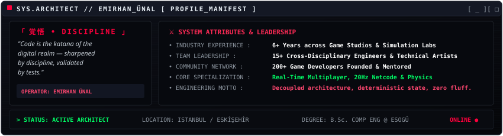
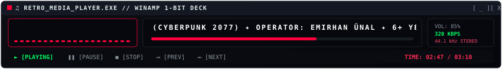
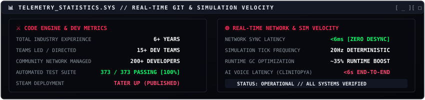

<div align="center">

<!-- ANIMATED CYBER-ONI HERO BANNER -->


<br><br>

<!-- QUICK STATUS DISPATCH BADGES -->
<p align="center">
  <a href="https://www.linkedin.com/in/benemirhanunal/"></a>
  <a href="https://store.steampowered.com/app/3989920/TaterUp/"></a>
  <a href="https://icarusogt.itch.io/"></a>
  <a href="mailto:emirhan_60unal@hotmail.com"></a>
</p>

</div>

---

### `01 // THE ARCHITECT & MANIFEST`

<div align="center">
  
</div>

<br>

> **"Decoupled architecture, predictable state machines, zero fluff."**
>
> 6+ yıldır ölçeklenebilir çok oyunculu yapılar, deterministik simülasyon döngüleri ve modüler oyun motoru mimarileri inşa eden **Bilgisayar Mühendisi & Sistem Mimarı**. 15+ kişilik çok disiplinli geliştirme ekiplerine teknik liderlik etmiş, 200+ geliştiricilik topluluk ağları yönetmiş ve düşük gecikmeli ağ katmanları ile deterministik fizik motorları tasarlamaya odaklanmıştır.

---

### `02 // ENGINEERING MASTERY & ARSENAL`

<table>
<tr>
<td width="50%" valign="top" style="background-color: #07090e; border: 1px solid #222530; border-radius: 6px; padding: 16px;">

#### 🌐 Distributed Systems & Real-Time Netcode
* **Host-Authoritative Replication**: State replication, client-side prediction, entity interpolation & lag-compensation algorithms.
* **Deterministic Combat Simulations**: 20Hz lockstep simulation loops validated with reproducible cross-platform golden checksums.
* **Network Frameworks**: Deep production mastery in **Photon Fusion**, **Unity Netcode for GameObjects (NGO)**, RPC pipelines, and Steamworks P2P.

</td>
<td width="50%" valign="top" style="background-color: #07090e; border: 1px solid #222530; border-radius: 6px; padding: 16px;">

#### ⚡ Gameplay Engineering & Physics Pipelines
* **Custom Kinematic Engines**: Bespoke arcade collision physics, trajectory chaining, velocity dampening, and procedural encounter generation.
* **Decoupled Architecture**: Rigid separation of Domain Authority from Presentation Layers using Assembly Definitions & Event Buses.
* **Modular Data Systems**: ScriptableObject-driven architecture, state machine controllers, and zero-runtime allocation object pooling.

</td>
</tr>
<tr>
<td width="50%" valign="top" style="background-color: #07090e; border: 1px solid #222530; border-radius: 6px; padding: 16px;">

#### 🧠 XR, Digital Twins & Generative AI Pipelines
* **Generative Multimodal XR**: Sub-6s real-time multimodal voice streaming pipelines integrating Gemini STT/LLM with ElevenLabs TTS and procedural lip-sync.
* **Spatial Computing & VR**: High-performance interactive VR environments for Meta Quest 3 and institutional medical training simulations (TÜSEB).
* **Autonomous Modeling**: Digital twin simulation pipelines for industrial systems and autonomous agent behaviors.

</td>
<td width="50%" valign="top" style="background-color: #07090e; border: 1px solid #222530; border-radius: 6px; padding: 16px;">

#### 🛠️ Profiling, Memory & Production Pipeline
* **Deep Performance Optimization**: Draw-call reduction, memory footprint minimization, and batching yielding **~35% runtime performance gains**.
* **Test-Driven Reliability**: Systems verified through hundreds of automated unit/integration tests with zero runtime desynchronization.
* **Full Mobile & Desktop Lifecycle**: Android APK/AAB build matrix, iOS optimization, Steamworks SDK deployment, and custom Unity editor tooling.

</td>
</tr>
</table>

<br>

<p align="left">
  
  
  
  
  
  
  
  
  
  
  
  
</p>

---

### `03 // DIGITAL LEGACY & CAREER MILESTONES`

<!-- ANIMATED RETRO WINAMP AUDIO PLAYER -->
<div align="center">
  
</div>

<br>

<!-- ANIMATED 5-TORII GATE TIMELINE -->
<div align="center">
  
</div>

<br>

<!-- SELF-HOSTED ANIMATED TELEMETRY & STATS CARD -->
<div align="center">
  
</div>

---

### `04 // COMMAND NEXUS: CONNECT`

<table width="100%" style="background-color: #07090e; border: 1px solid #222530; border-radius: 6px;">
<tr>
<td style="padding: 16px;">

```bash
$ ./connect_operator.sh --target=EMIRHAN_ÜNAL --protocol=SECURE_DISPATCH

> LINKEDIN     : https://www.linkedin.com/in/benemirhanunal/
> STEAM STORE  : https://store.steampowered.com/app/3989920/TaterUp/
> ITCH.IO      : https://icarusogt.itch.io/
> DIRECT EMAIL : emirhan_60unal@hotmail.com

[ STATUS: OPERATOR READY // SHOGUNATE STANDING BY ]
```

</td>
</tr>
</table>

<p align="center">
  <em>✦ "Code is the katana of the digital realm — sharpened by discipline, validated by tests." ✦</em>
</p>
