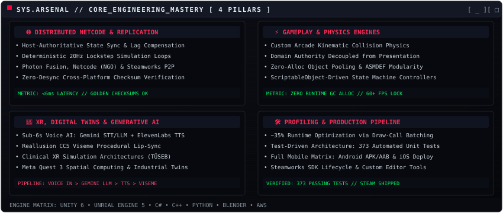

<div align="center">

<!-- HERO ANIMATED ONI BANNER -->


<br><br>

<!-- QUICK STATUS DISPATCH BADGES -->
<p align="center">
  <a href="https://www.linkedin.com/in/benemirhanunal/"></a>
  <a href="https://store.steampowered.com/app/3989920/TaterUp/"></a>
  <a href="https://icarusogt.itch.io/"></a>
  <a href="mailto:emirhan_60unal@hotmail.com"></a>
</p>

</div>

---

### `01 // THE ARCHITECT & MANIFEST`

<div align="center">
  
</div>

---

### `02 // ENGINEERING MASTERY & ARSENAL`

<div align="center">
  
</div>

<br>

<p align="left">
  
  
  
  
  
  
  
  
  
  
  
  
</p>

---

### `03 // GAMIFICATION: THE SHOGUN QUEST (INTERACTIVE RPG)`

<!-- ANIMATED ARCADE CABINET -->
<div align="center">
  
  <br><br>
  <a href="https://benemirhanunal.github.io/benemirhanunal/" target="_blank">
    
  </a>
</div>

<br>

<details>
<summary><b>🎮 [ CLICK TO INSERT COIN &amp; PLAY: BATTLE THE NETWORK DESYNC MONSTER ]</b></summary>

<br>

```text
╔══════════════════════════════════════════════════════════════════════════════╗
║  ⚔️ STAGE 01 // ENCOUNTER: RACE CONDITION & NETWORK DESYNC MONSTER           ║
║  HP: [████████████████████] 100%  // THREAT: HIGH LATENCY & PACKET LOSS      ║
║  CHOOSE YOUR SYSTEM ABILITY BELOW TO STRIKE:                                 ║
╚══════════════════════════════════════════════════════════════════════════════╝
```

<details>
<summary><b>🗡️ OPTION A: Execute 20Hz Deterministic Lockstep Slash</b></summary>

```text
┌─── [ ACTION: 20Hz LOCKSTEP SLASH EXECUTED! ] ────────────────────────────────┐
│ 💥 CRITICAL HIT! 9,999 DAMAGE!                                               │
│ The deterministic simulation loop forces reproducible state calculation!     │
│ The Desync Monster's jitter buffer collapses into zero latency!              │
│                                                                              │
│ 🎁 LOOT GAINED: [ +500 EXP ] [ 🛡️ GOLDEN CHECKSUM SHIELD UNLOCKED ]           │
│ 📜 SECRET LORE: "Deterministic lockstep ensures 100% desync-free netcode."   │
└──────────────────────────────────────────────────────────────────────────────┘
```

<details>
<summary><b>👑 ADVANCE TO FINAL BOSS: THE TITANIC DRAW-CALL OVERLORD</b></summary>

```text
┌─── [ FINAL BOSS: DRAW-CALL OVERLORD ] ───────────────────────────────────────┐
│ HP: [████████████████████] 100% // THREAT: GPU PIPELINE BOTTLENECK           │
│ What optimization protocol do you deploy?                                    │
└──────────────────────────────────────────────────────────────────────────────┘
```

<details>
<summary><b>⚡ DEPLOY PROTOCOL: GPU Batching &amp; Zero-Alloc Object Pooling</b></summary>

```text
╔══════════════════════════════════════════════════════════════════════════════╗
║  🏆 VICTORY! // ~35% RUNTIME PERFORMANCE BOOST ACHIEVED!                     ║
║                                                                              ║
║  ★ CONGRATULATIONS, WARRIOR!                                                 ║
║  You have restored peak performance to the Shogunate Engine!                 ║
║  TITLE UNLOCKED: "MASTER SYSTEMS ARCHITECT"                                 ║
║                                                                              ║
║  ✦ Connect with Emirhan Ünal in the Command Nexus below to build worlds! ✦  ║
╚══════════════════════════════════════════════════════════════════════════════╝
```

</details>
</details>
</details>

<details>
<summary><b>🧠 OPTION B: Overclock Generative AI Voice Pipeline (&lt;6s Latency)</b></summary>

```text
┌─── [ ACTION: MULTIMODAL NEURAL OVERCLOCK! ] ─────────────────────────────────┐
│ ⚡ FAST CAST! Gemini STT + LLM + ElevenLabs viseme alignment overwhelms!     │
│ Sub-6s end-to-end voice latency dispels the enemy illusion in real-time!     │
│                                                                              │
│ 🎁 LOOT GAINED: [ +450 EXP ] [ 🎭 PROCEDURAL VISEME TALISMAN UNLOCKED ]       │
└──────────────────────────────────────────────────────────────────────────────┘
```
</details>

<details>
<summary><b>🦝 OPTION C: Trigger Kinetic Cheek Boost &amp; Arcade Belly Slam</b></summary>

```text
┌─── [ ACTION: KINETIC MOMENTUM CHAIN 10X COMBO! ] ────────────────────────────┐
│ 💥 IMPACT! Custom arcade physics kinematics chain 10 consecutive bounces!    │
│ Zero runtime garbage collection allocation recorded! Frame rate locked at 60!│
│                                                                              │
│ 🎁 LOOT GAINED: [ +600 EXP ] [ ⚡ KINETIC MOMENTUM CORE UNLOCKED ]            │
└──────────────────────────────────────────────────────────────────────────────┘
```
</details>

</details>

---

### `04 // DIGITAL LEGACY & CAREER MILESTONES`

<!-- ANIMATED RETRO WINAMP AUDIO PLAYER -->
<div align="center">
  
</div>

<br>

<!-- ANIMATED 5-TORII GATE TIMELINE -->
<div align="center">
  
</div>

<br>

<!-- SELF-HOSTED ANIMATED TELEMETRY & STATS CARD -->
<div align="center">
  
</div>

---

### `05 // COMMAND NEXUS: CONNECT`

<div align="center">
  
</div>

<br>

<p align="center">
  <em>✦ "Code is the katana of the digital realm — sharpened by discipline, validated by tests." ✦</em>
</p>
