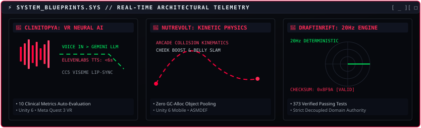

<div align="center">

<!-- ANIMATED CYBER-ONI HERO BANNER -->


<br><br>

<!-- QUICK STATUS DISPATCH BADGES -->
<p align="center">
  <a href="https://www.linkedin.com/in/benemirhanunal/"></a>
  <a href="https://store.steampowered.com/app/3989920/TaterUp/"></a>
  <a href="https://icarusogt.itch.io/"></a>
  <a href="mailto:emirhan_60unal@hotmail.com"></a>
</p>

</div>

---

### `01 // WHOAMI.SYS`

```text
╔═[ ⛩️ OPERATOR_MANIFEST.DAT ]═════════════════════════════════════════════════[ _ ][ X ]═╗
║                                                                                       ║
║   ┌─── [ MANGA_LOG: 覚悟 ] ───────────┐  ┌─── [ HARDWARE & ROLE SPECS ] ──────────┐   ║
║   │                                   │  │                                        │   ║
║   │   「 覚悟はいいか？               │  │  • OPERATOR : Emirhan Ünal             │   ║
║   │      コードは我が刃。             │  │  • ROLE     : Game Dev Shogun / Arch   │   ║
║   │      不屈の精神で挑む。 」        │  │  • EXP      : 6+ Years Industry        │   ║
║   │                                   │  │  • LEAD     : 15+ Developers Led       │   ║
║   │   "Code is the katana of the      │  │  • NETWORK  : 200+ Dev Community       │   ║
║   │    digital realm — sharpened      │  │  • DEGREE   : B.Sc. Comp Eng @ ESOGÜ   │   ║
║   │    by discipline, validated       │  │  • DOMAIN   : Multiplayer & Physics    │   ║
║   │    by tests."                     │  │  • ENGINE   : Unity 6 / UE5 / C#       │   ║
║   └───────────────────────────────────┘  └────────────────────────────────────────┘   ║
║                                                                                       ║
║   ┌─── [ CORE SUMMARY // CV MANIFEST ] ───────────────────────────────────────────┐   ║
║   │                                                                               │   ║
║   │  6+ yıldır ölçeklenebilir çok oyunculu yapılar, deterministik fizik           │   ║
║   │  motorları ve modüler Unity mimarileri inşa eden Bilgisayar Mühendisi.        │   ║
║   │  15+ kişilik geliştirme ekiplerine liderlik etmiş; TPS çok oyunculu           │   ║
║   │  altyapıları, dijital ikiz simülasyonları (~%35 performans kazanımı),          │   ║
║   │  TÜSEB bünyesinde klinik VR eğitim sistemleri ve üretken yapay zeka           │   ║
║   │  ses ardışık düzenleri (Gemini + ElevenLabs) geliştirmiştir.                  │   ║
║   │                                                                               │   ║
║   └───────────────────────────────────────────────────────────────────────────────┘   ║
╚═══════════════════════════════════════════════════════════════════════════════════════╝
```

```yaml
system_status:
  operator: "Emirhan Ünal"
  archetype: "Game Engine & Multiplayer Architect"
  focus_areas: [ Real-time Netcode, Custom Physics Pipelines, Deterministic Sims ]
  philosophy: "Decoupled architecture, predictable state machines, zero fluff."
```

---

### `02 // ARSENAL & TECH STACK`

```text
╔═[ ⚔️ CYBERNETIC_ARSENAL.SYS ]════════════════════════════════════════════════[ _ ][ X ]═╗
║                                                                                       ║
║  [ ENGINE & CORE ]        [ MULTIPLAYER & NET ]       [ OPTIMIZATION & PATTERNS ]     ║
║  -----------------        ---------------------       ---------------------------     ║
║  • Unity 6 (Expert)       • Photon Fusion             • Unity Profiler / Deep Trace   ║
║  • Unreal Engine 5        • Netcode for GameObjects   • Zero-Alloc Object Pooling     ║
║  • C# (.NET Framework)    • Deterministic 20Hz Loop   • Draw-Call Batching (~35% Boost║
║  • C++ / Python           • State Sync & Replication  • ScriptableObject Architecture ║
║  • Blender 3D             • AWS Cloud / NVIDIA Cloud  • SOLID & Clean Decoupled Arch  ║
║                                                                                       ║
║  [ LOAD CAPACITY GAUGE ]                                                              ║
║  C# / Unity Architecture : [████████████████████] 100%                                ║
║  Multiplayer & Netcode   : [██████████████████░░]  90%                                ║
║  Deterministic Physics   : [██████████████████░░]  90%                                ║
║  VR & Generative AI XR   : [████████████████░░░░]  80%                                ║
║                                                                                       ║
╚═══════════════════════════════════════════════════════════════════════════════════════╝
```

<p align="left">
  
  
  
  
  
  
  
  
  
  
  
  
</p>

---

### `03 // CORE DOMAINS & BLUEPRINTS`

<!-- ANIMATED ARCHITECTURAL RADAR & BLUEPRINT VISUALIZER -->
<div align="center">
  
</div>

<br>

```text
╔═[ 🦊 BLUEPRINT 01: CLINITOPYA — GENERATIVE AI VR CLINICAL SIMULATION ]═══════[ _ ][ X ]═╗
║                                                                                       ║
║   PLATFORM : Unity 6 • Meta Quest 3 VR          ROLE : Lead Developer                 ║
║   STACK    : Gemini STT/LLM • ElevenLabs TTS • Reallusion CC5 • ScriptableObjects     ║
║                                                                                       ║
║   • Procedural avatar lip-sync mapped dynamically via ElevenLabs viseme data.         ║
║   • Modular ScriptableObject AI persona engine supporting dynamic psychological scenarios.║
║   • Automated clinical session evaluation scoring engine across 10 therapeutic metrics.║
╚═══════════════════════════════════════════════════════════════════════════════════════╝

╔═[ 🦝 BLUEPRINT 02: NUTREVOLT — KINETIC MOBILE PHYSICS LAUNCHER ]═════════════[ _ ][ X ]═╗
║                                                                                       ║
║   PLATFORM : Unity 6 Mobile (Android / iOS)     ROLE : Lead Developer & Game Designer ║
║   STACK    : C# • Custom Arcade Physics • Assembly Definitions • Object Pooling       ║
║                                                                                       ║
║   • Bespoke arcade 2D/3D collision kinematics, rebound chaining & Cheek Boost abilities.║
║   • Decoupled event-driven state controllers built with zero runtime GC allocation.   ║
║   • Infinite procedural chunk generation with dynamic speed-adaptive encounter pacing.║
║   • In-editor custom telemetry suites for deterministic physics validation & balance. ║
╚═══════════════════════════════════════════════════════════════════════════════════════╝

╔═[ 🐉 BLUEPRINT 03: DRAFTINRIFT — DETERMINISTIC 20Hz AUTO-BATTLER ]════════════[ _ ][ X ]═╗
║                                                                                       ║
║   PLATFORM : Unity 6 & C#                       ROLE : Lead Systems Architect         ║
║   STACK    : Deterministic 20Hz Tick Engine • Golden Checksums • 373 Automated Tests  ║
║                                                                                       ║
║   • Full deterministic combat engine: targeting, casts, status effects & death queue.  ║
║   • Strategic 3-option draft match loop with Tactical Credit rerolls & comeback logic.║
║   • Certified with 373 passing automated tests ensuring 100% reproducible checksums.  ║
╚═══════════════════════════════════════════════════════════════════════════════════════╝
```

<details>
<summary><b>📜 Click to view Additional Production Deployments (Co-op Horrors &amp; Steam)</b></summary>

```text
┌─── HAUNTED MOVING COMPANY (1–4 Player Online Co-op Horror Comedy) ────────────┐
│ • Host-authoritative physics replication for synchronized cursed objects hauling│
│ • Living haunted environment dynamically sealing routes based on player chaos │
│ • Steam lobby architecture and modular cursed-item behavioral rulesets        │
└───────────────────────────────────────────────────────────────────────────────┘
┌─── UNREAL ENGINE 5 MULTIPLAYER HORROR (2-Player Asymmetric Co-op) ────────────┐
│ • Asymmetric co-op roles: Medallion seeker vs. Magic Torch protector (EOS)    │
│ • Physics-driven ragdoll predator system with NavMesh predictive tracking     │
└───────────────────────────────────────────────────────────────────────────────┘
┌─── TATER UP (Commercial Steam Release) ───────────────────────────────────────┐
│ • Shipped indie title with complete Steamworks SDK & achievement integration   │
│ • Link: https://store.steampowered.com/app/3989920/TaterUp/                   │
└───────────────────────────────────────────────────────────────────────────────┘
```

</details>

---

### `04 // DIGITAL LEGACY & TELEMETRY`

<!-- ANIMATED RETRO WINAMP AUDIO PLAYER -->
<div align="center">
  
</div>

<br>

<!-- ANIMATED 5-TORII GATE TIMELINE -->
<div align="center">
  
</div>

<br>

<div align="center">
  
</div>

---

### `05 // COMMAND NEXUS: CONNECT`

```text
╔═[ 📡 TERMINAL_DISPATCH.SH ]══════════════════════════════════════════════════[ _ ][ X ]═╗
║                                                                                       ║
║  $ ./connect_operator.sh --target=EMIRHAN_ÜNAL                                        ║
║                                                                                       ║
║  [>] LINKEDIN     : https://www.linkedin.com/in/benemirhanunal/                       ║
║  [>] STEAM STORE  : https://store.steampowered.com/app/3989920/TaterUp/              ║
║  [>] ITCH.IO      : https://icarusogt.itch.io/                                        ║
║  [>] DIRECT EMAIL : emirhan_60unal@hotmail.com                                       ║
║                                                                                       ║
║  ===================================================================================  ║
║  [ SYSTEM READY ] // DISPATCH INITIATED // SHOGUNATE STANDING BY                      ║
║  ===================================================================================  ║
║                                                                                       ║
╚═══════════════════════════════════════════════════════════════════════════════════════╝
```

<p align="center">
  <em>✦ "Code is the katana of the digital realm — sharpened by discipline, validated by tests." ✦</em>
</p>
